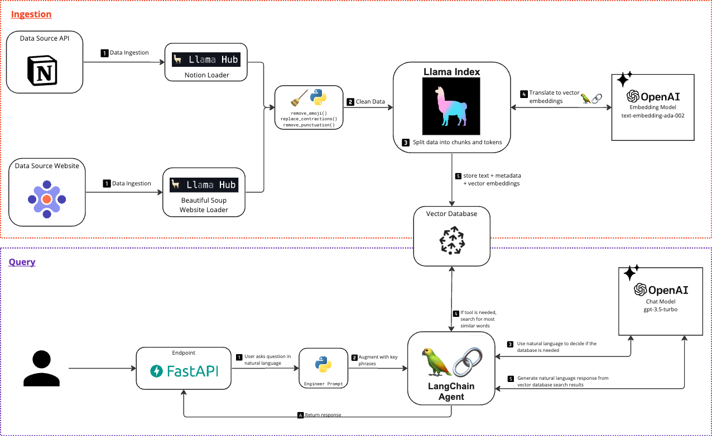

# Focused Labs Knowledge Base Demo · https://chat.withfocus.com/

This sample project demonstrates a possible implementation of a domain specific AI Knowledge Base using Focused Labs as
the example.

The UI (frontend code) lives in [this repository](https://github.com/focused-labs/knowledge-base-demo-ui).

## Why?

#### Why build this? Why does this matter?

- AI driven solutions will empower organizations to build on top of existing infrastructure and unlock legacy
- Customized AI ChatBots accelerate product development by making disparate and complex information easy to find
- Unblock teams to focus on what matters - building working software - rather than chasing down people and documentation

## What?

#### What is in this repository?

A python codebase that harnesses the power of semantic vector search fueled by advanced LLMs.



### Data Inputs:

1. Our external Notion wiki
2. Our public website: [Focused Labs](https://focusedlabs.io/)

## Prerequisites

1. A Pinecone Vector Database. You can create a free account [at Pinecone's website](https://www.pinecone.io/).
2. A Open AI API account (api key). You can sign up [at Open AI's website](https://platform.openai.com/signup).
3. Python (and your favorite IDE). We are using python v3.10.7.
4. (Optional) Notion API Key.


## Getting the demo running...

### Edit Configuration Files

#### Update `.env`

```
OPENAI_API_KEY = "<Open AI API Token Secure Note>"
NOTION_API_KEY = "<Notion API Token Secure Note>"
PINECONE_API_KEY = "<retrieve value Pinecone DB DEV credential>"
```

#### Update `config.py`

```
PINECONE_INDEX = "<name of your index, ex: "focusedlabs-pinecone-index">"
PINECONE_ENVIRONMENT = "<name of your pineconce env. ex: asia-southeast1-gcp-free>"
```

(Optional) You can explore other models. We recommend using the current configuration for best results.Then, ask a teammate to add you to the Focused
Labs Knowledge Base Hub project.

### The API

#### Run

```
 uvicorn main:app
```

Add `--reload` if you make a code change the app will restart on its own.

#### Endpoints

```
1. Endpoint: /
   Description: A simple endpoint that returns a "Hello World" message.
   Method: GET
   
   
2. Endpoint: /load-notion-docs
   Description: Loads documents from Notion based on provided Notion page IDs.
   Method: POST
   Payload: json
       {
         "page_ids": ["<NOTION_PAGE_ID_1>", "<NOTION_PAGE_ID_2>", ...]
       }
   
3. Endpoint: /load-website-docs
   Description: Loads documents based on provided URLs that are web scraped.
   Method: POST
   Payload: json
       {
         "page_urls": ["<URL_1>", "<URL_2>", ...]
       }
   
4. Endpoint: /query/
   Description: Accepts a question and role and returns the appropriate query result.
   Method: POST
   Payload: json
        {
          "text": "<user question here>",
          "role": "<user persona, ex: potential customer>"
        }
   Description: Accepts a question and returns the appropriate query result.
   
5. Endpoint: /delete_session
   Description: Deletes a conversation based on the provided session ID.
   Method: POST
   Payload: json
       {
         "session_id": "<YOUR_SESSION_ID>"
       }
   
```

### Run accuracy test

Cannot be run via command line.

Edit the run configuration for `accuracy_test_runner.py` and add the file that contains the list of questions you want
to ask. Ex: `questions.txt`


